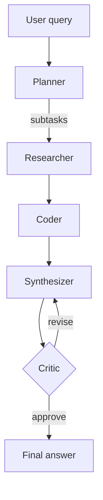

# Multi-Agent Research Assistant

A small, production-shaped multi-agent LLM system: a **Planner**, **Researcher**,
**Coder**, **Synthesizer** and **Critic** collaborate through a custom
orchestration graph with a reflection loop, sandboxed tool execution, a
FastAPI serving layer, an offline evaluation harness, and CI.

It ships with a deterministic, dependency-free `MockProvider` as the default
LLM, so the **entire project — pipeline, API, tests, and CI — runs with zero
API keys and zero network access**. Point it at Anthropic or OpenAI with one
environment variable when you want real model output.

## Why this project

This repo is a portfolio piece for AI engineering: it is less about a single
clever prompt and more about the surrounding system — orchestration,
tool safety, evaluation, and deployability — that turns an LLM call into a
reliable application.

| Concern | How it's addressed |
|---|---|
| **Orchestration** | A ~90-line dependency-free graph engine (`src/magent/graph.py`) with nodes, edges, and conditional routing — the same shape as LangGraph, implemented from scratch to show the underlying model, not just library usage. |
| **Reflection** | The Critic can send the Synthesizer back for another pass with concrete feedback, capped by `MAGENT_MAX_ITERATIONS` so the loop always terminates. |
| **Tool safety** | The Python REPL tool runs untrusted, LLM-generated code in an isolated process with a hard timeout and a restricted builtins allowlist (no `import`, `open`, `exec`, `eval`). The calculator tool parses an AST instead of calling `eval`. |
| **Provider portability** | Every agent depends only on the `LLMProvider` interface (`src/magent/llm.py`). Anthropic and OpenAI are implemented as plain HTTP calls (no SDK lock-in); a mock provider makes the system fully testable offline. |
| **Evaluation** | `evaluation/run_eval.py` is a small, trackable regression harness — not a demo that "looks like it works." |
| **Deployability** | FastAPI service, Dockerfile, and a GitHub Actions CI pipeline that runs tests, the eval harness, and a Docker build on every push. |

## Architecture



- **Planner** — breaks the query into 2-4 concrete subtasks.
- **Researcher** — answers research-flavored subtasks via a semantic search
  tool (TF-IDF over a small local corpus by default — swap in a real search
  API or vector DB without touching any agent code).
- **Coder** — answers computation-flavored subtasks using a safe calculator,
  falling back to the sandboxed Python REPL for anything the calculator's
  grammar doesn't cover.
- **Synthesizer** — combines notes into a draft answer, incorporating the
  Critic's feedback on later passes.
- **Critic** — approves the draft or sends it back for revision with a
  one-sentence reason. Bounded by `MAGENT_MAX_ITERATIONS` (default 3).

## Quickstart

```bash
python -m venv .venv && source .venv/bin/activate
pip install -e ".[dev]"

# Run a query end-to-end from the CLI (offline, no API key needed)
python examples/run_example.py "What is retrieval-augmented generation?"

# Run the test suite
pytest -v

# Run the offline evaluation harness
python evaluation/run_eval.py

# Serve the HTTP API
uvicorn magent.api:app --reload
# then: curl -X POST localhost:8000/chat -H 'content-type: application/json' \
#            -d '{"query": "What is a multi-agent system?"}'
```

### Using a real LLM

```bash
cp .env.example .env
# edit .env: MAGENT_LLM_PROVIDER=anthropic and set ANTHROPIC_API_KEY
```

### Docker

```bash
docker build -f docker/Dockerfile -t multi-agent-research-assistant .
docker run -p 8000:8000 multi-agent-research-assistant
```

## Project structure

```
src/magent/
  config.py        # environment-driven settings
  llm.py            # LLMProvider interface + Anthropic/OpenAI/Mock implementations
  memory.py          # ConversationMemory + TF-IDF VectorMemory
  state.py            # AgentState shared across the graph
  graph.py              # dependency-free node/edge orchestration engine
  pipeline.py             # wires agents + tools into the default graph
  api.py                    # FastAPI service
  agents/                     # Planner, Researcher, Coder, Synthesizer, Critic
  tools/                        # calculator, sandboxed python_repl, local web_search
evaluation/
  eval_cases.jsonl               # keyword-based regression cases
  run_eval.py                     # scoring harness
tests/                              # 27 tests covering tools, memory, graph, agents, API
docker/Dockerfile
.github/workflows/ci.yml
```

## Design notes / tradeoffs

- **Why a custom graph engine instead of LangGraph directly?** To keep the
  install footprint small and to demonstrate the underlying orchestration
  model rather than just calling a library. `Graph.run` is the only piece
  that would change if this were swapped for real LangGraph — every agent
  is a plain `AgentState -> AgentState` callable and would work unmodified.
- **Why TF-IDF instead of neural embeddings?** No model weights to download,
  no network dependency, deterministic — keeps the whole system runnable in
  CI/offline while still exercising a real retrieval pipeline. The
  `VectorMemory.add` / `search` interface is the seam where a neural
  embedder or a real vector DB would slot in.
- **Sandbox honesty**: the Python REPL tool's process isolation + restricted
  builtins is a reasonable demo-grade sandbox, not a substitute for
  OS-level isolation (containers, seccomp, gVisor) in a real production
  deployment with genuinely untrusted code.

## Roadmap

- [ ] Real vector DB backend (e.g. Chroma/FAISS) behind the same `VectorMemory` interface
- [ ] Streaming responses over the `/chat` endpoint
- [ ] LLM-as-judge evaluation alongside the keyword harness
- [ ] Structured tracing/observability (OpenTelemetry spans per node)

## License

MIT — see [LICENSE](LICENSE).
